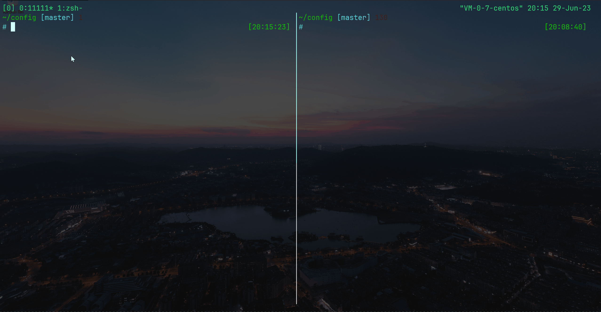

# README

some config file

## ZSH

### fzf intergration

`cd with fzf`


`file completion`


`process kill`


`find command history`


### other plugins
- [ohmyzsh](https://github.com/ohmyzsh/ohmyzsh.git)
- [zsh-autosuggestions](https://github.com/zsh-users/zsh-autosuggestions.git)
- [zsh-syntax-highlighting](https://github.com/zsh-users/zsh-syntax-highlighting.git)

## TMUX

no plugin needed

### clipboard support

`tmux clipboard sync with system using osc52 sequence`




## INSTALL

```shell
# requirment
# zsh
# tmux
# /usr/bin/fzf
# /usr/bin/fd (recommand)
git clone https://github.com/CJYLZS/config.git --depth=1
cd config
./zshrc.zsh
./tmux
```


